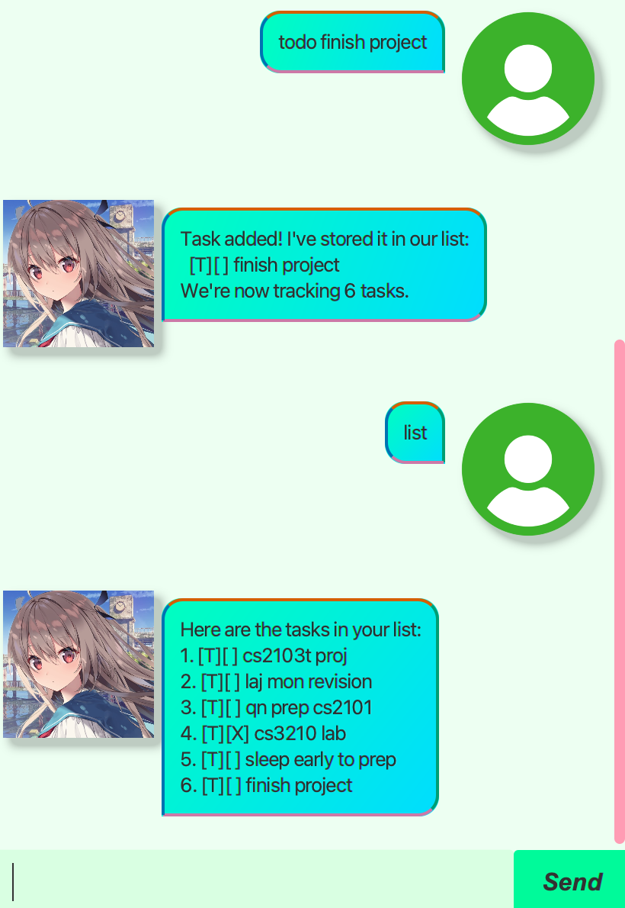

# Duke User Guide

// Update the title above to match the actual product name

// Product screenshot goes here

// Product intro goes here
# ATRI User Guide

## Product Overview



ATRI is a high-performance chatbot designed to assist users with task management in a structured and intuitive manner. With ATRI, you can effortlessly track, manage, and organize your tasks, ensuring efficiency and clarity in your daily activities.

## Features

### Adding Tasks
ATRI allows you to add different types of tasks:
- **To-Do Task**: `todo <task description>`
- **Deadline Task**: `deadline <task description> /by <yyyy-MM-dd HHmm>`
- **Event Task**: `event <task description> /from <yyyy-MM-dd HHmm> /to <yyyy-MM-dd HHmm>`

#### Example Usage:
```
todo Buy groceries
```
Expected Output:
```
Task registered! I've added this one:
  [T][ ] Buy groceries
Now you have X tasks in the list. Exciting!
```

### Viewing Tasks
- To see all tasks, use: `list`

#### Example Usage:
```
list
```
Expected Output:
```
Here are your tasks:
1. [T][ ] Buy groceries
2. [D][ ] Submit report (by: 2025-02-18 1800)
3. [E][ ] Attend meeting (from: 2025-02-19 0900 to: 2025-02-19 1100)
```

### Marking Tasks
- **Mark task as done**: `mark <task number>`
- **Unmark task**: `unmark <task number>`

#### Example Usage:
```
mark 1
```
Expected Output:
```
Understood! I've marked this task as done for you:
  [T][X] Buy groceries
```

### Deleting Tasks
- **Delete a task**: `delete <task number>`

#### Example Usage:
```
delete 2
```
Expected Output:
```
Got it! I've removed this task:
  [D][ ] Submit report (by: 2025-02-18 1800)
Now you have X tasks left. Let's keep going!
```

### Finding Tasks
- **Search for tasks containing a keyword**: `find <keyword>`

#### Example Usage:
```
find groceries
```
Expected Output:
```
Ooh! I found some tasks that match what you're looking for:
1. [T][ ] Buy groceries
Did I do a good job? Let's keep improving together!
```

### Getting Help
- **View help message**: `help`

#### Example Usage:
```
help
```
Expected Output:
```
Hello! I'm Atri, your high-performance assistant!
I love learning and helping you keep track of everything.
Here's how you can use me:
- Add a task:
  • todo <task description>
  • deadline <task description> /by <yyyy-MM-dd HHmm>
  • event <task description> /from <yyyy-MM-dd HHmm> /to <yyyy-MM-dd HHmm>
- Manage tasks:
  • list       : Show all tasks!
  • mark <n>   : Mark task number n as done.
  • unmark <n> : Mark task number n as not done yet.
  • delete <n> : Remove a task.
- Search for tasks:
  • find <keyword> : Find tasks containing a keyword.
If you ever need help, just ask! Let's do our best together!
```

### Exiting ATRI
- **Exit the application**: `bye`

#### Example Usage:
```
bye
```
Expected Output:
```
Bye-bye! I hope to see you again soon. Take care, okay?
```

Enjoy using **ATRI** for managing your tasks efficiently!

